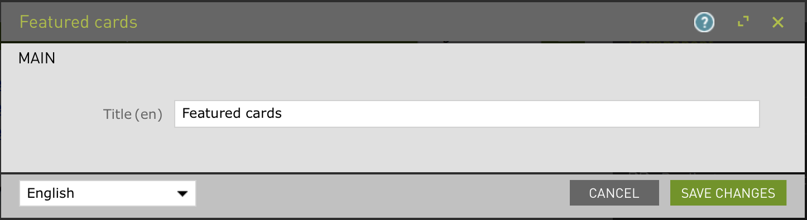

# Featured cards - Component template for Magnolia CMS

Displays a selected set of featured pages as cards with title, abstract and image.  

## Features
Multiple cards can be added. Use the override tab to override the title, abstract or image.

The css classes are using the BEM approach, which will emphasis on readability and avoiding collisions. Use your own styling to make the card look great!

An optional title can be added above the component.

Cards can be added to the `Cards` area

The linked page can be selected.

The title, abstract and image will be retrieved from the target page.

Use the fields on the tab `override` to provide your own title, abstract or image.

## Usage
Make the component available to authors. Use the included css file in `webresources` or better: create your own style to make the cards shine!

(To make this component available on the mtk basic page, you could use the decoration included in _dev/decorations.)

The image is retrieved from the page properties so please add the image field to the page properties or use the override function.

### Template parameters
Set parameter `imageVariation` to the variation name used for resizing the card images. Use decorations to override the default variation.
    
## Demo
To see the component in action, open the Pages app in Magnolia AdminCentral and import the files in `_dev/demos`.

## Information on Magnolia CMS

This directory is a Magnolia 'light module'.
https://docs.magnolia-cms.com

## Contribute to the Magnolia component ecosystem
It's easy to create components for Magnolia and share them on github and npm. I invite you to do so and join the community. Let's stop wasting time by developing the same thing again and again, rather let's help each other out by sharing our work and create a rich library of components.

## License
MIT

## Contributors

Jordie Diepeveen